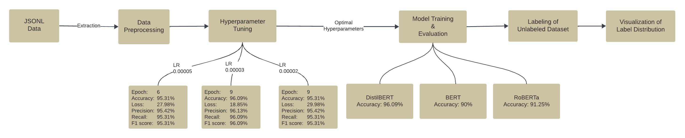

# Text Classification Using Huggingface BERT Models
## Documentation Link

[](https://codelabs-preview.appspot.com/?file_id=1wR9BsFz6GxrY2R3BgPlDjeAVfKBwXWOBt_6A3Is6pWM#3)

## Technologies Used
[](https://www.python.org/)
[](https://pandas.pydata.org/)
[](https://huggingface.co/docs/transformers/en/model_doc/bert)
[](https://plotly.com/)

## Architecture


## Goal
Develop a proof-of-concept system capable of accurately categorizing financial excerpts into the following classes:
- **TEXT**: This category includes textual content such as sentences or paragraphs relevant to financial analysis. Tables are classified as TEXT only if they and are formatted solely to present textual content.
- **NOISE**: This includes any text or tables that are not directly useful for financial analysis, such as generic legal disclaimers or miscellaneous non-specific content. For example, an index or table of contents is noise since it's not company specific and no analyst would submit queries to search for content in the table of contents.
- **FINANCIAL-TABLE**: This pertains to tables that display financial data structured in rows and columns, featuring key financial metrics.

## Overview

This project aims to classify text data into three categories: FIN_TABLE, NOISE, and TEXT, using state-of-the-art transformer models from the Huggingface library. The models utilized in this proof of concept (POC) include DistilBERT, BERT, and RoBERTa.

### Steps performed for text-classification
1. Prepare and preprocess data.
2. Hyperparameter Tuning using DistilBERT
3. Train and evaluate DistilBERT, BERT, and RoBERTa models.
4. Label the unlabeled dataset using the trained models.
5. Visualize the label distribution.

## Results


Hyperparameter tuning was performed with the DistilBERT model to identify the optimal learning rates and epochs. The results guided the training of all three models.

### Optimal Hyperparameters
- **Learning Rate**: 3e-5
- **Epochs**: 9

## Results

### Label Distribution


The bar graph represents the distribution of labels in the dataset after labeling the unlabeled data using the trained models. The distribution is as follows:
- NOISE: The largest category, with 5,578 instances, indicating a significant portion of the data was classified as noise.
- TEXT: A substantial portion of the data, with 3,801 instances, was identified as text content.
- FIN_TABLE: The smallest category, with 1,003 instances, representing financial table content.


### DistilBERT Model
- **Learning Rate**: 3e-5
- **Epochs**: 9
- **Evaluation Metrics**:
  - Accuracy: 96.09%
  - Precision: 96.13%
  - Recall: 96.09%
  - F1 Score: 96.10%

### BERT Model
- **Learning Rate**: 3e-5
- **Epochs**: 9
- **Evaluation Metrics**:
  - Accuracy: 90.00%
  - Precision: 90.34%
  - Recall: 90.00%
  - F1 Score: 90.04%

### RoBERTa Model
- **Learning Rate**: 3e-5
- **Epochs**: 9
- **Evaluation Metrics**:
  - Accuracy: 91.25%
  - Precision: 91.45%
  - Recall: 91.25%
  - F1 Score: 91.28%


## How to Use

1. **Install dependencies**:
    ```bash
    pip install -r requirements.txt
    ```

3. **Run the Jupyter Notebook**:
    ```bash
    jupyter notebook
    ```
    
## Conclusion

Based on the evaluation metrics, the DistilBERT model demonstrated the highest performance with an accuracy of 96.09%, making it the most effective model for this text classification task. 